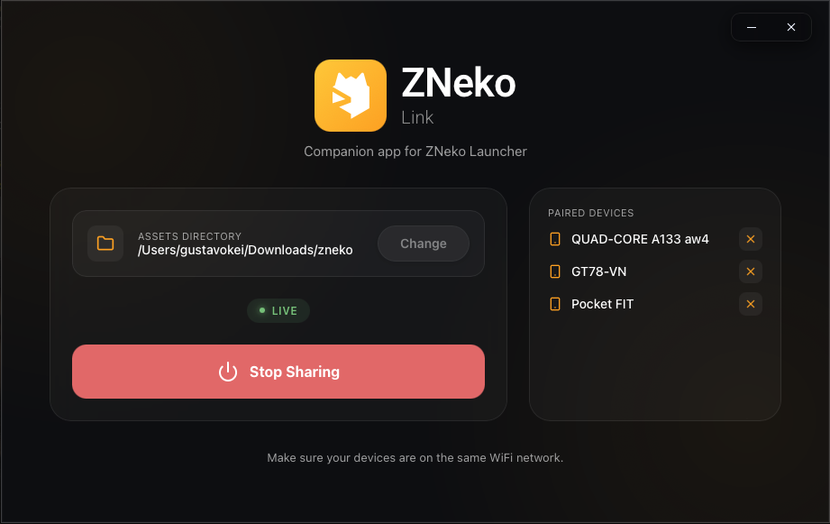

# ZNeko Link

**The desktop companion for managing your Android handhelds.**

*A lightweight desktop application for browsing your library, transferring games, preserving files, and managing multiple handhelds over your local network.*

[Installation](#installation) • [How to Use](#how-to-use) • [Security](#security)

---

## What is ZNeko Link?

ZNeko Link is the Windows and macOS companion application for **[ZNeko Launcher](https://github.com/zneko-org/zneko-launcher)**.

It helps bring together tasks that would otherwise require USB transfers, cloud storage, synchronization tools, and manual file management.

With ZNeko Link, you can browse your library with its artwork, transfer games to your handheld over your local network, preserve saves and configuration files, and reuse supported launcher data across multiple devices.

Your complete library can remain visible in ZNeko Link even when every game is not currently stored on a handheld. This provides a Steam-like view of the games available on your computer and makes it easier to decide what to transfer next.

You do not need to use every feature. ZNeko Link can also be used simply for wireless ROM transfers, manual file synchronization, or backups.

> [!IMPORTANT]
> ZNeko Link is currently part of the early ZNeko pre-alpha ecosystem.
>
> Bugs, incomplete features, compatibility issues, and breaking changes should be expected while development continues.

---

## Showcase

  

---

## Installation

Download the latest installer for your operating system from the [Releases page](https://github.com/zneko-org/zneko-link/releases).

- **Windows**  
  Download and run the `.exe` installer. If Windows SmartScreen appears, click **More info → Run anyway**.

- **macOS**  
  Download the Universal `.dmg` (Apple Silicon and Intel), open it, and drag **ZNeko Link** into **Applications**.

  Because ZNeko Link is not distributed through the App Store, the first launch is blocked with *"Apple could not verify ZNeko Link is free of malware"*. This is macOS's standard warning for apps from independent developers. To open it:

  1. Click **Done** (not "Move to Trash").
  2. Open **System Settings → Privacy & Security**.
  3. Scroll all the way down to the **Security** section, where you will see *"ZNeko Link" was blocked to protect your Mac*.
  4. Click **Open Anyway** and confirm.

  This is only needed once; afterwards the app opens normally.

> [!NOTE]
> Only the latest version is kept on the Releases page. This is intentional, since older pre-alpha builds may contain known issues, incompatible data formats, or outdated behavior.

---

## How to Use

1. Open ZNeko Link on your computer.
2. Select an empty or existing folder on your computer to act as your ZNeko library root.
3. Once selected, ZNeko Link will automatically manage the following structure inside that folder:
   - `roms/`: Stores your platform folders and game files.
   - `backups/`: Stores files exported from or prepared for import into ZNeko Launcher.
   - `filelist.json`: A generated manifest used by the handheld to browse the available library.
4. Create subfolders for your platforms (e.g., `roms/gba/`, `roms/psx/`) and place your game ROMs inside them.
5. Click **"Start Sharing"**.
6. Connect your Android handheld and computer to the same local network.
7. Open ZNeko Launcher. It will attempt to discover and connect to your PC automatically on boot. If it doesn't connect, you can go to **Settings > Link Connection** in the app to connect manually.
8. The first time a handheld connects, ZNeko Link asks you to **approve the device**. A confirmation code is shown on both screens, so approve only if they match. Approved devices are remembered and can be removed at any time from the ZNeko Link window.
9. Browse your available library from the handheld and choose what to transfer.

No manual IP address is normally required. ZNeko Launcher searches the local network and discovers ZNeko Link automatically.

---

## Security

Access to the shared folder is protected by **device pairing**: the first time a handheld connects, you approve it in the ZNeko Link window by confirming a code shown on both screens. Only approved devices can browse, transfer, or modify anything. Every other device on the network is rejected.

- **You are in control.** Approved devices are listed in the ZNeko Link window and can be removed at any time, which revokes their access immediately.
- **Credentials are never exposed.** Only a cryptographic hash of each device's credential is stored, and it lives outside the shared folder.
- **Nothing leaves your network.** There are no accounts, no cloud, and no third-party servers involved.

> [!NOTE]
> Like most local file-sharing tools (DLNA, SMB, media servers), traffic between ZNeko Link and your approved handhelds is not encrypted, so ZNeko Link is best used on networks you trust, such as your home Wi-Fi. As common sense, keep the shared folder to game-related files, and keep independent backups of saves you care about. The project is still in pre-alpha and is provided as-is.