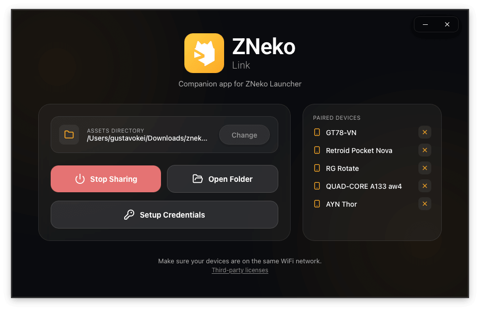
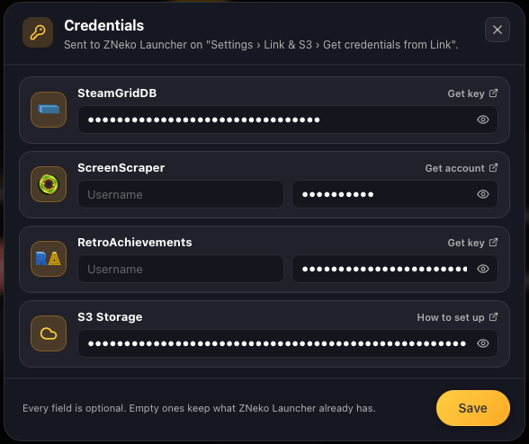
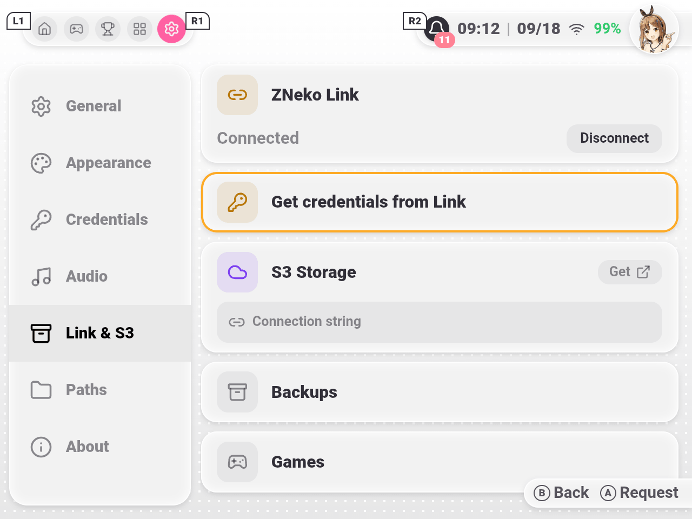

<div align="center">

# ZNeko Link


**The desktop companion for managing your Android devices.**

[]()
[](https://github.com/zneko-org/zneko-link/releases)
[](https://ko-fi.com/gustavokei)

<p align="center">
  <a href="https://github.com/zneko-org/zneko-link/releases"></a>
</p>

[What is ZNeko Link?](#what-is-zneko-link) • [Showcase](#showcase) • [Installation](#installation) • [How to Use](#how-to-use) • [Security](#security)

</div>

---

## What is ZNeko Link?

ZNeko Link is the Windows, macOS and Linux companion application for **[ZNeko Launcher](https://github.com/zneko-org/zneko-launcher)**.

It helps bring together tasks that would otherwise require USB transfers, cloud storage, synchronization tools, and manual file management.

---

## Showcase

<p align="center">
  
</p>

---

## Installation

Download the latest installer for your operating system from the [Releases page](https://github.com/zneko-org/zneko-link/releases).

- **Windows**  
  Download and run the `.exe` installer. If Windows SmartScreen appears, click **More info → Run anyway**.

- **macOS**  
  Download the Universal `.dmg` (Apple Silicon and Intel), open it, and drag **ZNeko Link** into **Applications**.

  Because ZNeko Link is not distributed through the App Store, the first launch is blocked with *"Apple could not verify ZNeko Link is free of malware"*. This is macOS's standard warning for apps from independent developers. To open it:

  1. Click **Done** (not "Move to Trash").
  2. Open **System Settings → Privacy & Security**.
  3. Scroll all the way down to the **Security** section, where you will see *"ZNeko Link" was blocked to protect your Mac*.
  4. Click **Open Anyway** and confirm.

  This is only needed once; afterwards the app opens normally.

- **Linux**  
  Download the `.AppImage` for your architecture: `x86_64` for regular PCs, or `aarch64` for ARM machines (Raspberry Pi, ARM Chromebooks, Linux VMs on Apple Silicon). Make it executable and run it; there is nothing to install, and updates are applied from inside the app:

  ```bash
  chmod +x ZNeko-Link-x86_64.AppImage
  ./ZNeko-Link-x86_64.AppImage
  ```

  AppImages need FUSE, which every mainstream desktop distribution ships. If yours does not, run it with `./ZNeko-Link-x86_64.AppImage --appimage-extract-and-run` instead.

---

## How to Use

1. Open ZNeko Link on your computer.
2. Select an empty or existing folder on your computer to act as your ZNeko library root.
3. Once selected, ZNeko Link will automatically manage the following structure inside that folder:
   - `roms/`: Create subfolders for your platforms (e.g., `roms/gba/`, `roms/psx/`) and place your game ROMs inside them.
   - `backups/`: Create folder backups here to sync files to/from your Android device (for example `backups/drivers/`, `backups/saves/`, `backups/cheats/`, etc)
   - `filelist.json`: A generated manifest used to browse the available library.
   - `credentials.json`: Stores your configured service credentials (SteamGridDB, ScreenScraper, RetroAchievements, S3).
4. Click **"Start Sharing"**.
5. Connect your Android device and computer to the same local network.
6. Open ZNeko Launcher. It will attempt to discover and connect to your PC automatically on boot. If it doesn't connect, you can go to **Settings > Link & S3 > ZNeko Link** in the app to connect manually.
7. The first time a device connects, ZNeko Link asks you to **approve the device**. A confirmation code is shown on both screens, so approve only if they match, then press **Codes match** on the Android device. Approved devices are remembered and can be removed at any time from the ZNeko Link window.
8. Browse your available library from the Android device and choose what to transfer.

No manual IP address is normally required. ZNeko Launcher searches the local network and discovers ZNeko Link automatically.

---

## Credentials Management

ZNeko Link can now send credentials to ZNeko Launcher. This eliminates the tiring process of fetching and typing credentials on your Android device.

1. On ZNeko Link click on **"Setup Credentials"**.
2. Fill the forms. If you unsure where to get each credential, click on the links to the right of each input.
3. Using ZNeko Launcher connect your Android device to ZNeko Link.
4. In ZNeko Launcher go to **Settings > Link & S3 > Get credentials from Link** and click it.
5. Approve the transaction on ZNeko Link.
6. Credentials will be sent to ZNeko Launcher and the app will restart.

<p align="center">
  
  
</p>

> [!NOTE]
> ZNeko Link uses a persistent self-signed certificate because local IP addresses cannot use an ordinary public web certificate. The verification code shown during first pairing authenticates that certificate, and the launcher pins its full fingerprint for later connections. There is no plaintext fallback. As common sense, keep the shared folder to game-related files, and keep independent backups of saves you care about.
